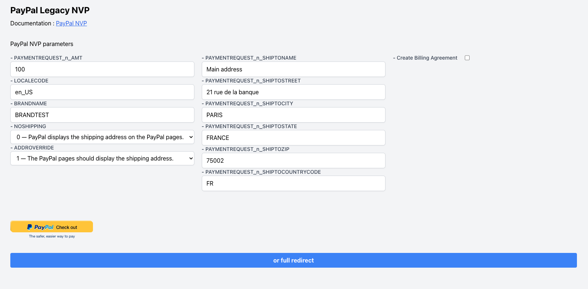
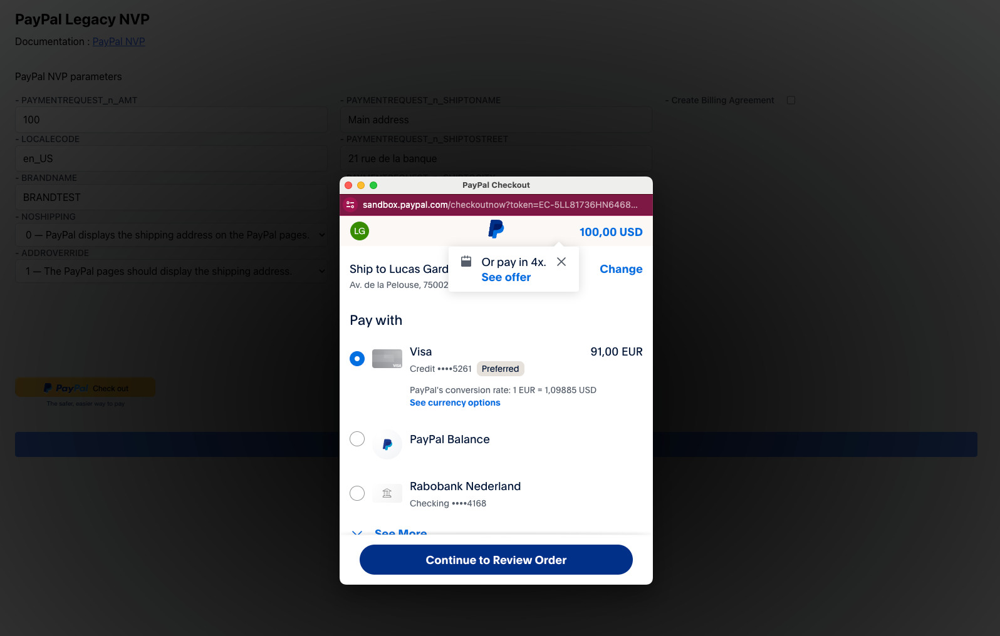
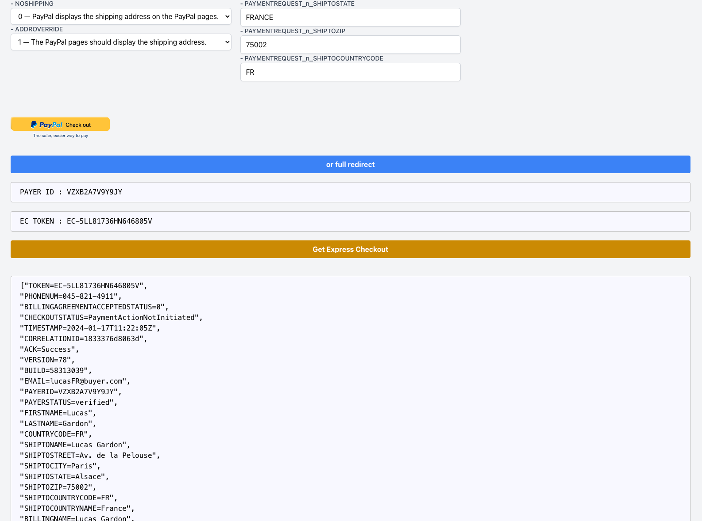

# PayPal Legacy NVP Integration

PayPal Tutorial: [https://developer.paypal.com/docs/archive/express-checkout/](https://developer.paypal.com/docs/archive/express-checkout/)

## Installation

1. Clone the repository
2. Install dependencies: `npm install`

## Configuration

Duplicate `.env.exemple` to a `.env` file at the root of the project and add the necessary environment variables.

## How to Run

To start the project, run the following command:

```bash
npm start
```

## How to Use

Go to /shorcut or /vault to test PayPal shortcut or PayPal vault

## Screenshots



<br />



<br />


